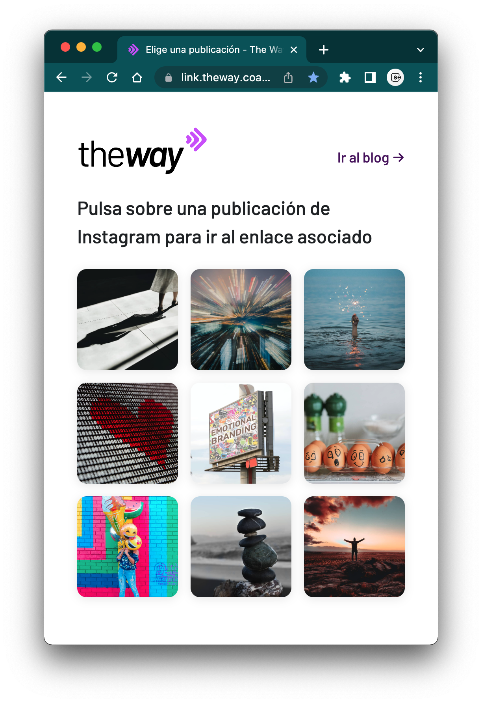
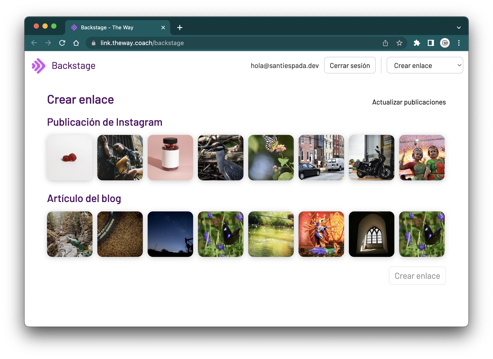
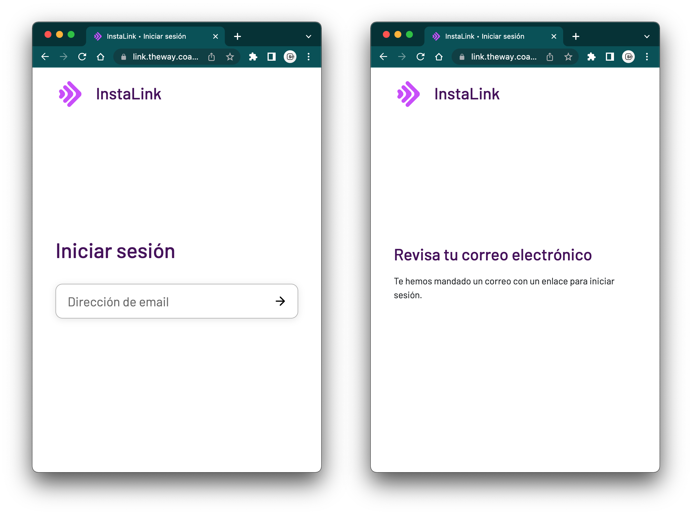
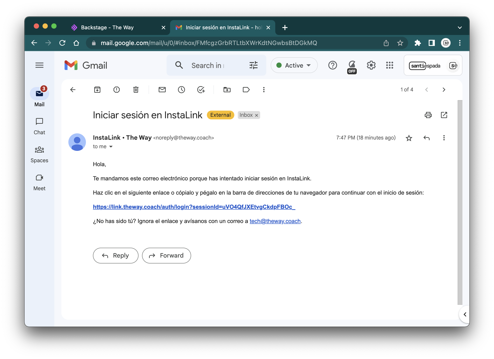
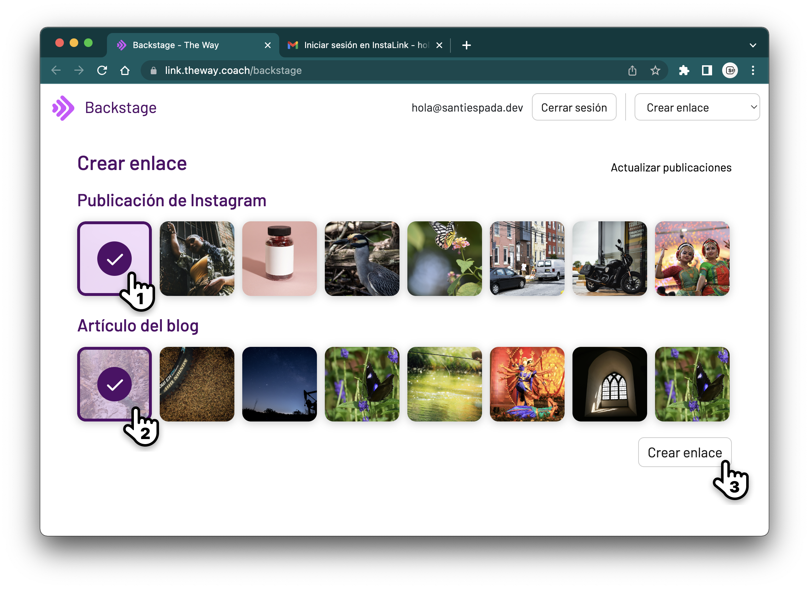
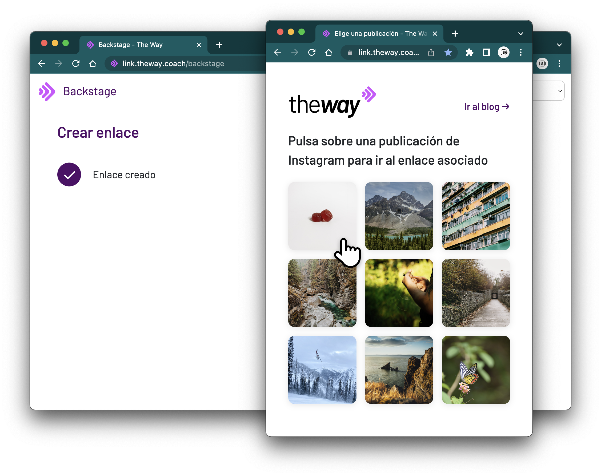
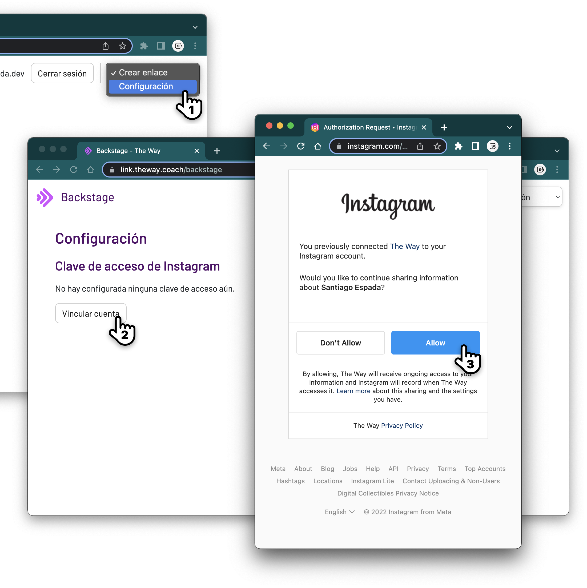

# Manual de usuario

## Índice

1. Qué es InstaLink
1. Vista general y conceptos
1. Operativa
1. Resolución de problemas

## 1. Qué es InstaLink

InstaLink es una aplicación web que sirve como nexo entre las publicaciones de Instagram y los artículos del blog. Este tipo de páginas son muy populares y usadas por creadores de contenido, ya que Instagram ofrece muy poca flexibilidad y solo permite tener un enlace utilizable (clicable) en la biografía del perfil si la cuenta no ha sido aprobada por Instagram, para lo cual es necesario tener un número considerable de seguidores.

## 2. Vista general y conceptos

La aplicación está dividida en dos partes: pública y operativa.

### Parte pública: galería de enlaces

> Accesible en https://link.theway.coach

Consiste en la página accesible al público. En ella se muestran los _enlaces_ que han sido creados en forma de galería de imágenes.

<a href="./img/link_view.png">

</a>

Un _enlace_ representa la relación entre una _publicación_ de Instagram (el origen) y una _publicación_ del blog (el artículo de destino), por lo que toman la imagen de la publicación de Instagram y la _URL_ (dirección web) del artículo del blog.

### Parte operativa (backstage): panel de creación de enlaces y configuración

> Accesible en https://link.theway.coach/backstage

El `backstage` (_detrás del escenario_) es una parte de la aplicación con acceso restringido en la que la persona administradora de la aplicación puede gestionar el contenido de la misma. Para entrar, es necesario iniciar sesión usando un correo electrónico autorizado (_@theway.coach_).

En la vista principal se muestra un listado de publicaciones en dos filas distintas: Instagram y el blog. Por el momento, desde este panel solo es posible crear enlaces, no modificarlos ni eliminarlos.

## 3. Operativa

### Acceder al backstage

El backstage es accesible en la dirección [https://link.theway.coach/backstage](https://link.theway.coach/backstage). En caso de que no exista una sesión activa, será necesario iniciar sesión.

Para ello habrá que introducir un correo electrónico autorizado (acabado en `@theway.coach`), pulsar el botón de continuar y seguidamente comprobar la bandeja de entrada de dicho correo. El mensaje puede tardar unos segundos en llegar.

Una vez recibido el mensaje, será suficiente con pulsar el enlace para continuar.

### Crear un enlace

Una vez dentro del backstage, la vista principal es la herramienta de creación de enlaces.

Para crear un enlace, basta con:

1. Pulsar en una publicación de origen (Instagram) para seleccionarla.
   > Si no encuentras una publicación reciente, puedes pulsar "Actualizar publicaciones" para refrescar el listado.
1. Seleccionar una publicación de destino (blog).
1. Comprobar que la asociación es correcta y pulsar el botón "Crear enlace".

En unos segundos el enlace habrá sido creado y podremos revisarlo en la página pública (https://link.theway.coach).

## 3. Resolución de problemas

### No aparecen las últimas publicaciones de Instagram, incluso tras recargar la página o pulsar el botón de "Actualizar publicaciones"

En ocasiones, la clave usada para acceder a las publicaciones de Instagram puede caducar. En este caso, es necesario refrescar o volver a vincular la cuenta de Instagram con la aplicación.

Para ello es necesario pulsar el desplegable de la esquina superior derecha y elegir la opción "Configuración" (1).

En esta vista se muestra el estado de la integración con Instagram. Para vincular la aplicación con Instagram, basta con pulsar "Vincular cuenta" (2) y continuar el proceso de inicio de sesión en Instagram (3). Al volver a la aplicación, las publicaciones deberían poder refrescarse de nuevo.
